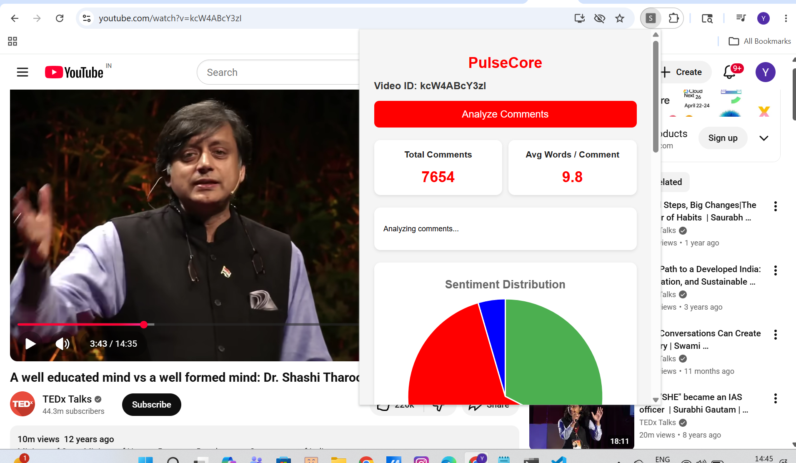
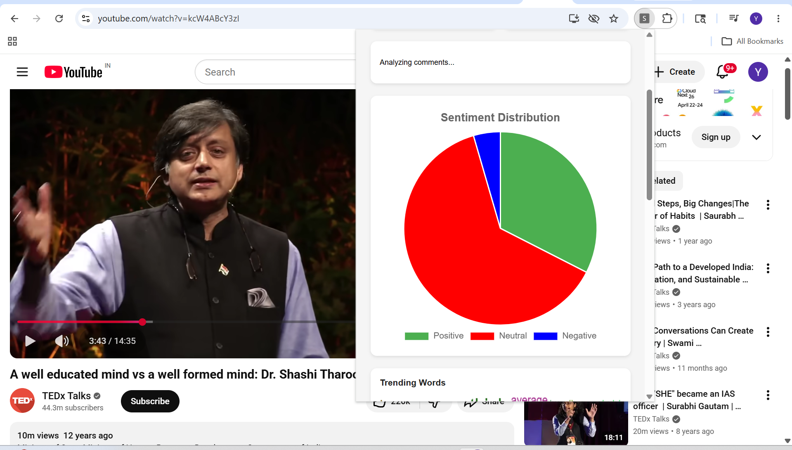
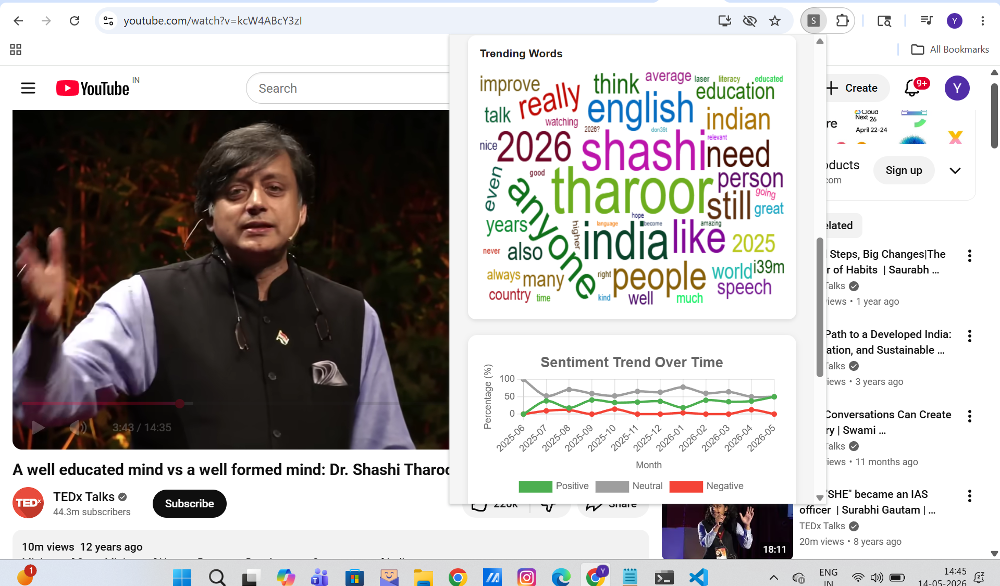
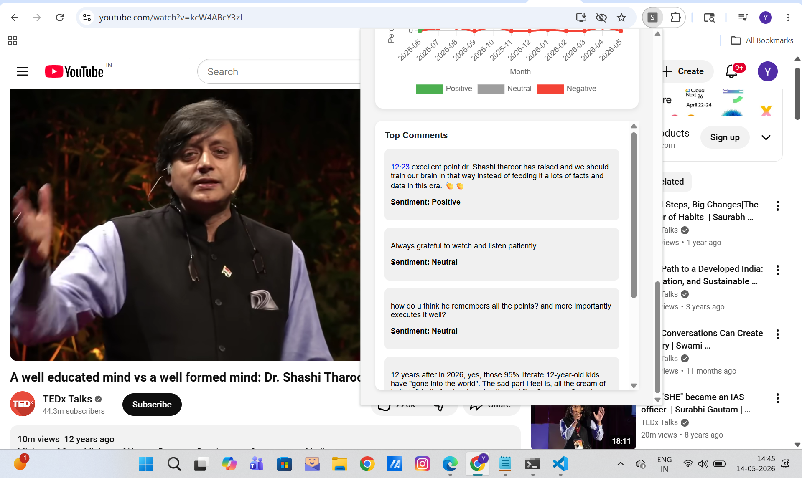

# PulseCore: AI-Powered YouTube Comment Sentiment Analysis

> A production-ready Chrome extension and MLOps platform that analyzes YouTube comments and delivers actionable insights for content creators using machine learning.


---

## Overview

PulseCore is an end-to-end machine learning product that analyzes the sentiment of YouTube comments and presents rich analytics directly inside a Chrome extension.

With a single click, users can analyze any YouTube video's comments and instantly view:

* Sentiment distribution (Positive, Neutral, Negative)
* Total comments and analyzed comments
* Average words per comment
* Top comments with sentiment labels
* Word cloud of most frequent terms
* Monthly sentiment trend chart

The project demonstrates the complete ML lifecycle—from data collection and model training to production deployment and frontend integration.

---

## Why PulseCore?

YouTube creators often receive thousands of comments, making it difficult to manually understand:

* Overall audience sentiment
* Recurring feedback and discussion topics
* How sentiment changes over time
* Which comments are most impactful

PulseCore transforms raw comments into actionable insights, enabling creators to make data-driven content decisions.

---

## Key Features

### Chrome Extension Dashboard

* KPI cards:

  * Total comments
  * Average words per comment
* Sentiment distribution pie chart
* Word cloud visualization
* Monthly sentiment trend chart
* Top comments with sentiment labels

### Machine Learning Backend

* Fetches comments using YouTube Data API v3
* Cleans and preprocesses text
* Predicts sentiment using LightGBM
* Returns structured analytics in JSON

### MLOps Pipeline

* Data versioning with DVC
* Experiment tracking with MLflow
* Model registry with DagsHub
* Automated model promotion to Production
* Unit and API testing with pytest
* CI/CD with GitHub Actions

### Cloud Deployment

* Dockerized FastAPI application
* Container images stored in Amazon ECR
* Deployed to AWS EC2 using CodeDeploy
* Auto Scaling Group + Application Load Balancer

---

## Project Highlights

* Analyzes up to 200 comments per request
* Retrieves the real total comment count from YouTube
* Returns analytics in ~2–3 seconds
* Production-ready Chrome extension UI
* Automated model testing and deployment
* Scalable cloud deployment on AWS

---
## Chrome Extension Setup
1. Download the Extension Source Code
Clone the frontend repository:

```bash
git clone https://github.com/yogibaba7/PULSECORE_FRONTEND
```
2. Open Chrome.
3. Navigate to `chrome://extensions/`.
4. Enable **Developer Mode**.
5. Click **Load unpacked**.
6. Select the `chrome-extension/` folder.
7. Open any YouTube video and click the PulseCore icon.

---

## Screenshots







---
## Experiment Tracking

All model training experiments, parameters, metrics, and artifacts are tracked using MLflow on DagsHub.

🔗 **View Experiment Dashboard:**  
https://dagshub.com/yogibaba7/Youtube_comment_analysis/experiments

Through this dashboard, you can explore:

- Model hyperparameters
- Training and validation metrics
- Experiment comparisons
- Logged artifacts
- Registered model versions

This ensures full transparency and reproducibility of the model development process.
---

## System Architecture

```text
YouTube Video
      ↓
Chrome Extension (Popup UI)
      ↓
Application Load Balancer
      ↓
FastAPI Backend (Docker)
      ↓
YouTube Data API + LightGBM Model
      ↓
Analytics Engine
      ↓
JSON Response
      ↓
Interactive Dashboard
```

---

## Machine Learning Lifecycle

```text
Data Collection
      ↓
Data Preprocessing
      ↓
Feature Engineering
      ↓
Model Training
      ↓
Model Evaluation
      ↓
Experiment Tracking (MLflow)
      ↓
Model Registry (DagsHub)
      ↓
Model Testing
      ↓
Model Promotion
      ↓
Production Deployment
```

---

## Tech Stack

### Frontend

* JavaScript
* HTML
* CSS
* Chart.js
* Chrome Extension APIs

### Backend

* Python
* FastAPI
* Uvicorn
* Pandas
* NumPy
* NLTK
* LightGBM

### MLOps

* DVC
* MLflow
* DagsHub
* pytest
* GitHub Actions

### Deployment

* Docker
* AWS EC2
* Amazon ECR
* AWS CodeDeploy
* Auto Scaling Group
* Application Load Balancer

---
## API Endpoints

| Method | Endpoint         | Description                           |
| -----: | ---------------- | ------------------------------------- |
|    GET | `/`              | Root endpoint                         |
|    GET | `/health`        | Health check                          |
|   POST | `/predict`       | Predict sentiment for custom comments |
|   POST | `/analyze-video` | Analyze YouTube video comments        |
|    GET | `/docs`          | Swagger UI                            |

---

## Example API Response

```json
{
  "total_comments": 5821,
  "analyzed_comments": 200,
  "avg_words_per_comment": 14.8,
  "positive_percent": 23.0,
  "neutral_percent": 72.0,
  "negative_percent": 5.0,
  "results": [
    {
      "comment": "Great explanation!",
      "sentiment": "Positive"
    }
  ],
  "top_words": [
    ["great", 12],
    ["video", 9]
  ],
  "trend_data": [
    {
      "month": "2026-01",
      "positive": 30.0,
      "neutral": 60.0,
      "negative": 10.0
    }
  ]
}
```

---

## Model Performance

|    Metric | Score |
| --------: | ----: |
|  Accuracy |   85.12% |
| Precision |   83.45% |
|    Recall |   84.93% |
|  F1 Score |   84.27% |


---

## CI/CD Pipeline

GitHub Actions automatically performs:

1. Install dependencies
2. Execute DVC pipeline
3. Run model tests
4. Run API tests
5. Promote model to Production
6. Build Docker image
7. Push image to Amazon ECR
8. Upload deployment bundle to Amazon S3
9. Trigger AWS CodeDeploy
10. Deploy updated container to EC2

---

## Deployment Architecture

```text
Git Push
    ↓
GitHub Actions
    ↓
DVC Pipeline + Tests
    ↓
Docker Build
    ↓
Amazon ECR
    ↓
AWS CodeDeploy
    ↓
EC2 Auto Scaling Group
    ↓
Application Load Balancer
    ↓
FastAPI Container
```

---

## Engineering Challenges Solved

| Challenge                  | Solution                                 |
| -------------------------- | ---------------------------------------- |
| Slow inference             | Batch prediction for all comments        |
| Unreliable DOM scraping    | Switched to YouTube Data API             |
| Secret exposure            | Environment variables and GitHub Secrets |
| LightGBM Docker error      | Installed `libgomp1`                     |
| Large dependency downloads | Increased pip timeout                    |
| Test import issues         | Package-based project structure          |

---

## Business Impact

PulseCore helps content creators:

* Understand audience sentiment at scale
* Identify recurring praise and criticism
* Monitor sentiment trends over time
* Discover high-impact comments
* Improve future content strategy

---

## What I Learned

This project provided hands-on experience in:

* Chrome Extension Development
* FastAPI Backend Design
* NLP Preprocessing
* LightGBM Model Deployment
* MLflow and DagsHub
* DVC Pipelines
* Docker Containerization
* AWS Deployment
* GitHub Actions CI/CD
* Automated Testing

---
## Future Improvements

- Improve sentiment prediction performance by replacing the current machine learning model with advanced deep learning architectures such as BERT, RoBERTa, or DistilBERT.
- Build a dedicated troll detection model to identify provocative, inflammatory, and abusive comments.
- Develop a spam comment detection model to automatically flag promotional, repetitive, and bot-generated comments.
- Integrate Large Language Models (LLMs) to generate concise summaries of audience feedback, highlighting key themes, complaints, and suggestions.
- Expand analytics with advanced features such as:
  - Emotion detection (joy, anger, sadness, surprise)
  - Topic modeling to uncover recurring discussion themes
  - Keyword and phrase extraction
  - Engagement analysis by sentiment
  - Comparison across multiple videos
  - Audience question detection
  - Comment clustering
- Add downloadable reports in PDF, Excel, and CSV formats for easy sharing and documentation.
- Build a historical dashboard to track sentiment trends and audience behavior over time.
- Support multilingual sentiment analysis for comments in multiple languages.
- Introduce user authentication and saved analysis history for content creators.
- Deploy a scalable inference pipeline with caching, asynchronous processing, and model monitoring.
---

## Author

**Yogesh Chouhan**

* GitHub: [https://github.com/yogibaba7](https://github.com/yogibaba7)
* LinkedIn: [https://www.linkedin.com/in/yogesh-chouhan-b36462273](https://www.linkedin.com/in/yogesh-chouhan-b36462273)
* Email: [yogeshchouhan263@gmail.com](mailto:yogeshchouhan263@gmail.com)

---

## License

This project is licensed under the MIT License.

---

## Support

If you found this project useful, please consider giving it a ⭐ on GitHub.
